# Developer Portfolio Template

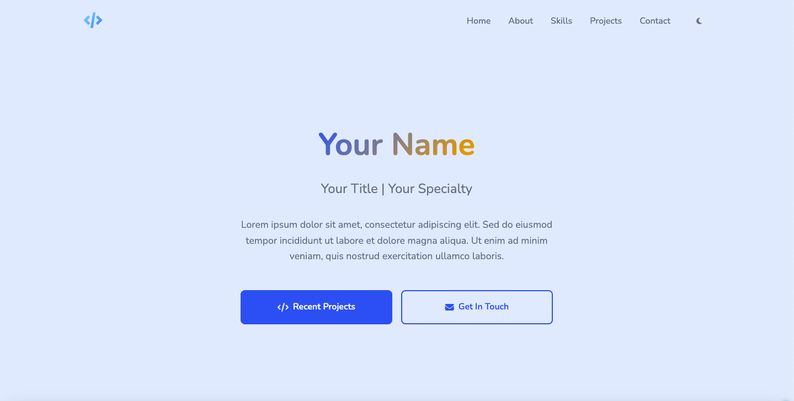
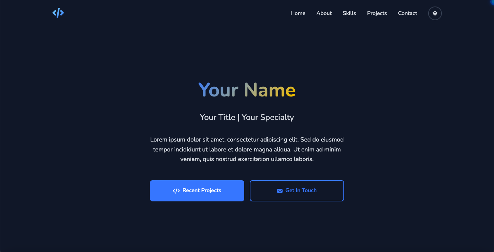

A clean, modern developer portfolio template with light and dark theme support that's perfect for showcasing your skills, projects, and experience as a software developer. Enjoy!

## Features

- **Light/Dark Theme Toggle** - Automatic theme switching with system preference detection
- **Fully Responsive** - Works on all device sizes
- **Modern Design** - Clean, professional layout with smooth animations
- **SEO Optimized** - Enhanced meta tags (Open Graph, Twitter Cards, JSON-LD) for better search visibility
- **Contact Form Integration** - Built-in web inquiry form component
- **Optional Blog Integration** - Hashnode GraphQL API example (commented out, ready to use)
- **Optional Web Components** - Typewriter effect, custom cursor, and back-to-top button
- **Accessibility** - ARIA labels and semantic HTML throughout
- **Fast & Lightweight** - Pure HTML, CSS, and JavaScript
- **Easy to Customize** - Well-organized code with TODO comments

## Quick Start

1. **Clone the repository**

   ```bash
   git clone https://github.com/DrAcula27/portfolio-simple-template.git
   cd portfolio-simple-template
   ```

2. **Open in browser**

   ```bash
   # Simply open index.html in your browser
   open index.html
   ```

3. **Customize**
   - Look for `TODO` comments throughout the code
   - Replace placeholder text with your actual information
   - Update `index.html` to update content
   - Modify `styles.css` for styling changes
   - Update `script.js` for functionality tweaks

## Customization

### Personal Information

Edit the following sections in `index.html`:

- **SEO Meta Tags** (in `<head>`) - Update with your name, website URL, social media handles
- **Hero section** - Your name, title, and description
- **About section** - Your bio, skills, and experience
- **Skills section** - Replace "Skill 1, 2, 3..." with your actual technologies
- **Projects section** - Replace "Project 1, 2, 3..." with your real projects
- **Contact information** - Your social media links and email

### Skills & Technologies

Update the skills grid in the HTML to match your tech stack:

```html
<div class="skill-category">
  <h3><i class="fas fa-code"></i> Frontend</h3>
  <ul class="skill-list">
    <li>Your Technology</li>
    <!-- Add more skills -->
  </ul>
</div>
```

### Colors & Styling

Customize the color scheme by modifying CSS variables in `styles.css`:

```css
:root {
  --primary-color: #2563eb;
  --secondary-color: #1e40af;
  --accent-color: #f59e0b;
  /* Update colors to match your brand */
}
```

### Contact Form

The portfolio includes two form web components - choose the one that fits your needs:

**Form Option 1: Minimalist Contact Form (Default)**

The template uses the [minimalist-contact-form](https://github.com/DevManSam777/minimalist-contact-form) web component by default. This is a clean, simple contact form perfect for basic inquiries with fields for name, email, phone, and message.

- **GitHub:** https://github.com/DevManSam777/minimalist-contact-form
- **Customization:** See the README in the repo for full list of customizable attributes

**Form Option 2: Full Web Inquiry Form**

For more detailed project inquiries, you can switch to the [web-inquiry-form](https://github.com/DevManSam777/web_inquiry_form) component. This includes additional fields for budget, timeline, project type, and more detailed project information.

- **GitHub:** https://github.com/DevManSam777/web_inquiry_form
- **Customization:** See the README in the repo for full list of customizable attributes

**Switching Between Forms:**

To switch between forms in `index.html`:

1. Comment out the current form's script import in the `<head>` section
2. Uncomment the desired form's script import
3. Comment out the current form component in the Contact section
4. Uncomment the desired form component

Both forms are highly customizable through HTML attributes including colors (light/dark mode), typography, border radius, and custom messages.

**Backend Options:**

Both forms require a backend API endpoint:

**Option 1: Use DevLeads (Recommended)**

[DevLeads](https://github.com/devmansam777/devleads) is a complete lead/project management system that:

- Sends email notifications to you and your clients
- Tracks and manages leads/projects
- Provides a dashboard to view all inquiries
- Includes a built-in API endpoint for both forms

Simply deploy DevLeads and update the form's `endpoint` or `api-url` attribute to point to your DevLeads instance.

**Option 2: Use Your Own API**

Create your own backend API endpoint and update the `endpoint` (for minimalist-contact-form) or `api-url` (for web-inquiry-form) attribute in the form component.

**Option 3: Replace the Form**

Replace the form component with your preferred form solution.

### Optional Features

**Blog Integration:**
The template includes commented-out code for fetching blog posts from Hashnode's GraphQL API.

To enable:

1. Uncomment the blog section in `index.html`
2. Uncomment the blog functions in `script.js`
3. Update the Hashnode blog URL in the `fetchHashnodePosts()` function
4. Uncomment the blog nav link

**Optional Web Components:**
Uncomment these in `index.html` if you want to use them:

- **Typewriter Effect** - Animated typing text
- **Custom Cursor** - Custom mouse cursor design
- **Back-to-Top Button** - Smooth scroll to top

All web components are by [DevManSam777](https://github.com/DevManSam777).

## File Structure

```
portfolio_template/
├── index.html          # Main HTML file
├── styles.css          # All styling and themes
├── script.js           # JavaScript functionality
├── assets/             # Images and icons
│   └── code_icon.png
└── README.md           # This file
```

## Browser Support

- Chrome
- Firefox
- Safari
- Edge

## Contributing

Feel free to clone this project and make it your own! If you find bugs or have suggestions for improvements, please open an issue or submit a pull request.

## Credits

- Icons by [Font Awesome](https://fontawesome.com/)
- Font family: Nunito by Google Fonts
- Web components by [DevManSam777](https://github.com/DevManSam777)
- Template based on DevManSam777's [portfolio_template](https://github.com/DevManSam777/portfolio_template)


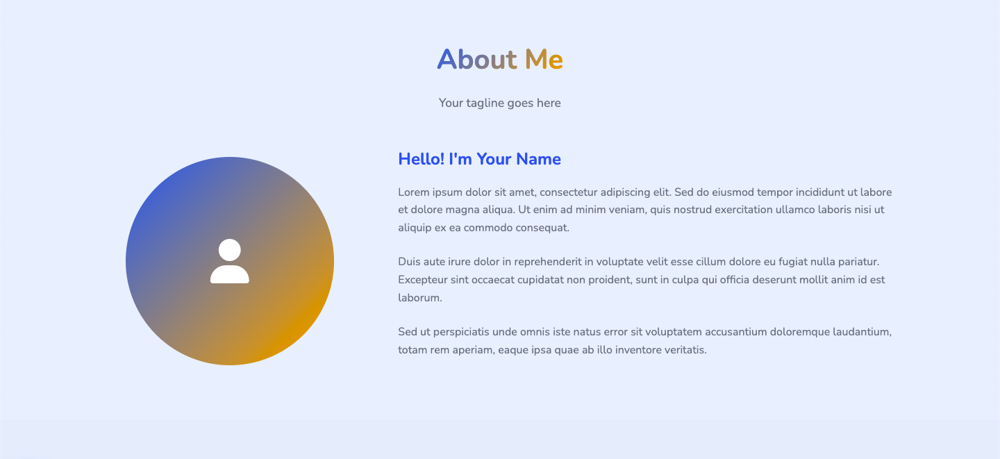
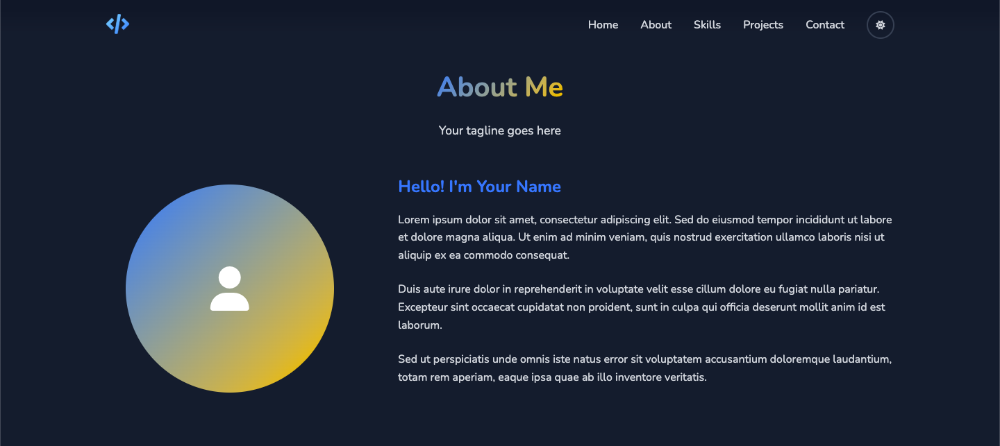
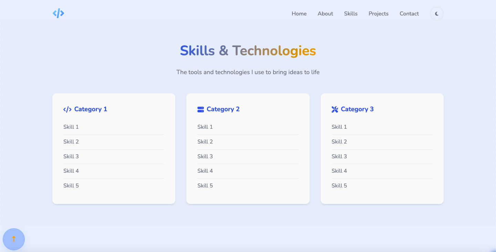
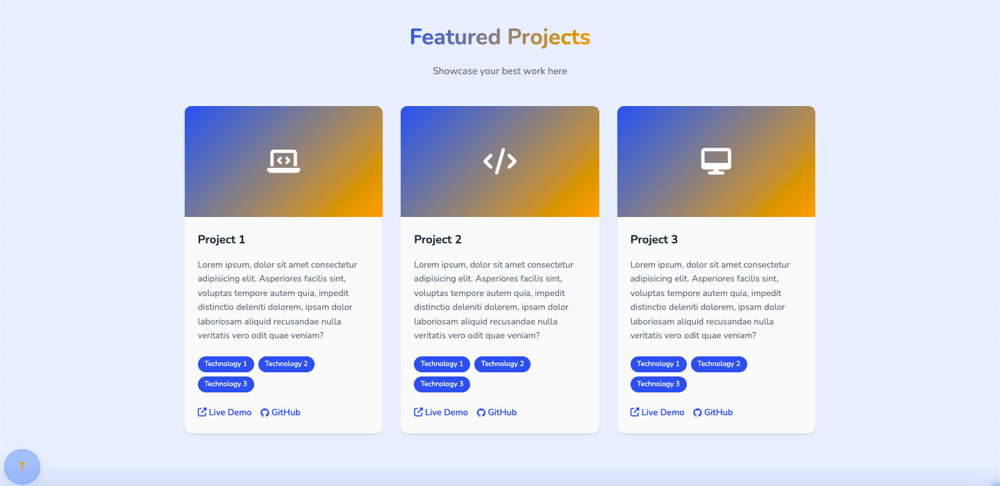
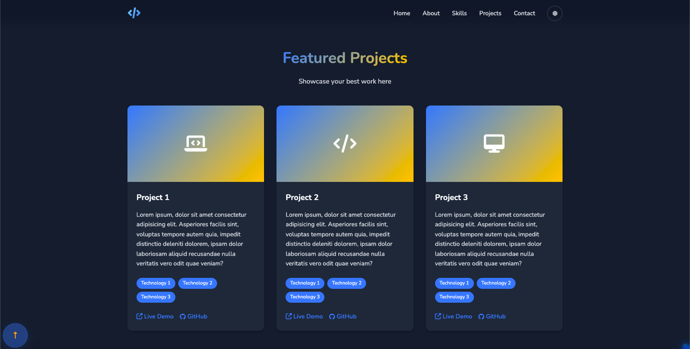
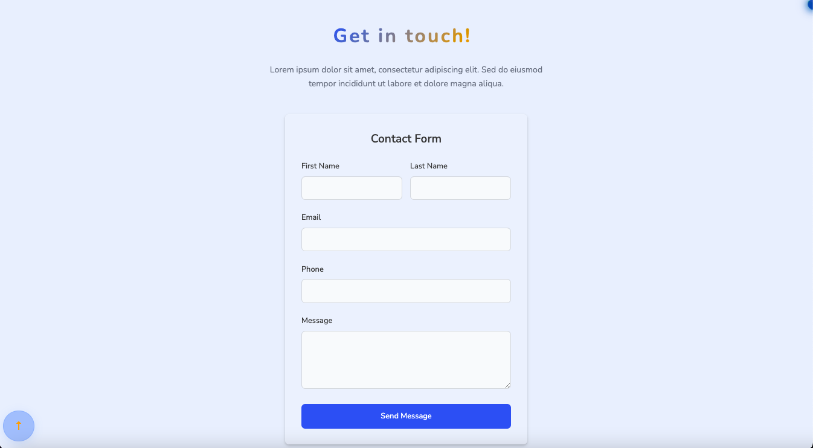
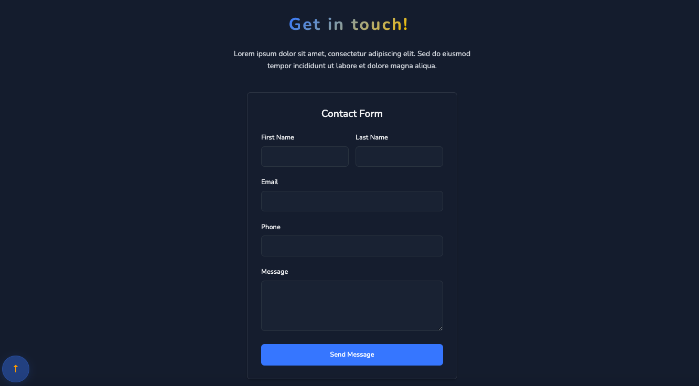
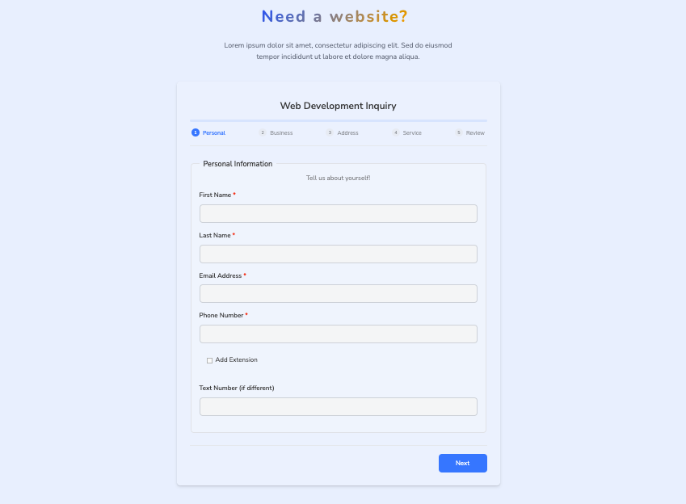
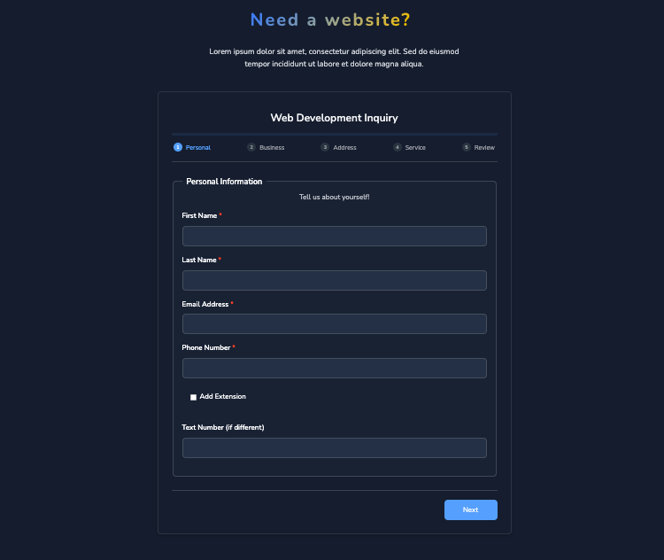
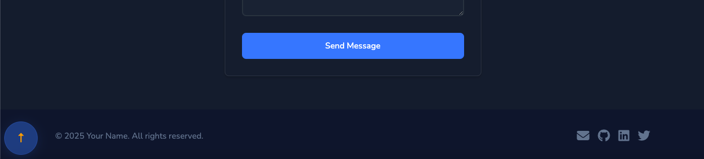

## License

[LICENSE](LICENSE)

Copyright (c) 2025 DrAcula27
